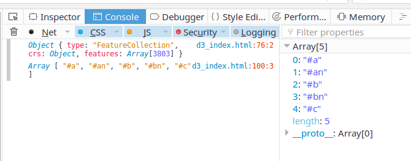

### Adding a data driven legend

Wouldn't it be cool to add a legend to this map? Becuase we have no clue which classes all exist, we will let D3 make the legend for us!

:arrow_forward: Let's create a svg area to add the legend to the web page:

``` js
//Create Legend
var legend = d3.select("body")
	.append("svg")
	.attr("class", "legend")
	.attr("width", 200)
	.attr("height", 300);
```

:arrow_forward: Use the geoJson data for really creating the legend! After calling the GeoJson data with D3, put the following code in the function. Now check the console in the browser! 

``` js
var unique_values = d3.map(data.features, function(d){return d.properties.styleUrl;}).keys()
console.log(unique_values)
``` 
:info: The variable `unique_values` is an array containing all the unique classes that occur in the styleUrl property. 



We can use this information to create a circle and a label for every class! 

``` js
legend.selectAll("circle")
	.data(unique_values)
	.enter()
	.append("circle")
	.attr("class", "cl")
	.attr("cx", 10)
	.attr("cy", function(d, i) { return i * 30 + 15;})
	.attr("r", 8)
	.style("fill", function(d){
		if (d == "#a") {return "red"}
		else if (d == "#b") {return "blue"}
		else { return "yellow"}
	})
	.style("opacity", 0.8);

legend.selectAll("text")
	.data(unique_values)
	.enter()
	.append("text")
	.text(function(d){
		return "class " + d 
	})
	.attr("x", 30 )
    .attr("y", function(d, i) { return i * 30 + 20;})
	.attr("fill", "#ffffff")
	.style("text-align","left")
    .style("font-size", "16px");
``` 

### Adding a TimeScale graph

