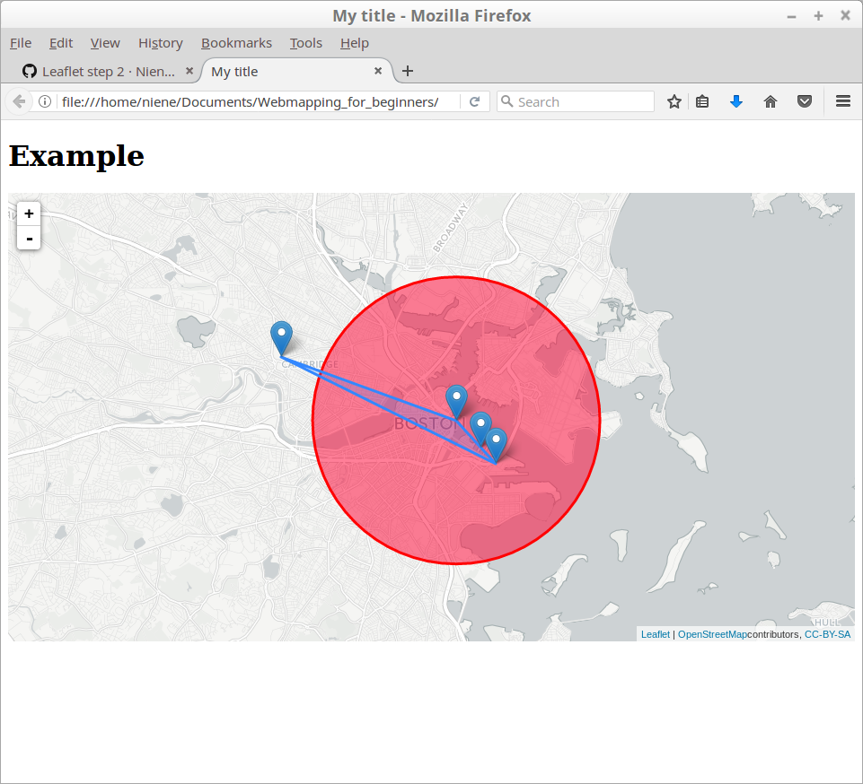

In [[Leaflet step 2]] we will add markers, circles and polygons to our map.

### Vector Data vs Raster data
Our background map tiles are static raster images. In the next part we will add markers, circles and polygons which are vector based data. In [[Leaflet step 3]] we will even add a GeoJSON file which is also vector based. 

**Raster** data is like a picture that you would take with a digital camera: at the lowest level of abstraction, it is a list of pixels with values. When you ‘zoom in’ and look closer at raster data, at some point you’ll see these discrete pixels, and it will look pixelated.


**Vector data** stores basic geometries rather than pixel data. No matter how much you ‘zoom in’ on vector data, you won’t see pixels: the data stored is composed of geometric points and lines, and only converted into an image when necessary.


### Markers, circles and polygons
Now we will add custom markers, circles and polygons to your map. (for example your home address). 

:arrow_forward: Add the following to your map:

``` js
var marker = L.marker([42.349239, -71.041342]).addTo(map);
```
> **JS** *`var` stands for variable. Variables store data so that they can be used later on in the program.
> Here the keyword `var` creates a new variable named `marker`. The value stored is a Leaflet marker which is immediately added to our map.*

:arrow_forward: Add another 4 markers. (friends, places you lived or visited?). **Note: give the `var` another name every time.** Example:

``` js
var brewery = L.marker([42.346868, -71.034396]).addTo(map);
```

:arrow_forward: Provide the markers with a pop-up. For the Harpoon Brewery we add the following pop-up:

``` js
var popup = "Write your pop up text here";
brewery.bindPopup(popup); 
``` 

> **JS** *Did you notice a `;` at the end of every statement? The semicolon tells the computer that the statement has ended.*

:arrow_forward: Now place a circle on the map, use your own coordinates:

``` js
var circle = L.circle([42.359116, -71.049592], 500, {
	color: 'red',
	fillColor: '#f03',
	fillOpacity: 0.5
}).addTo(map);
``` 

:arrow_forward: Connect all previous markers with a polygon. Use all previous coordinates and combine them in the right order.

``` js
var polygon = L.polygon([
	[42.349239, -71.041342],
	[42.346868, -71.034396],
	[42.359116, -71.049592]
]).addTo(map);
```
Your script should look like the following:

``` js
<script>
	//initialize the map
	var map = L.map('map').setView([42.3600825, -71.0588801], 12);
	
	//Create baselayer - tiles
	var backgroundMap = L.tileLayer('http://{s}.basemaps.cartocdn.com/light_all/{z}/{x}/{y}.png', {
		attribution: '<a href="http://openstreetmap.org">OpenStreetMap</a>contributors, <a href="http://creativecommons.org/licenses/by-sa/2.0/">CC-BY-SA</a>',
		maxZoom: 19
	});
	
	backgroundMap.addTo(map);
	
	//Add markers
	var brewery = L.marker([42.346868, -71.034396]).addTo(map);
	brewery.addTo(map);
	
	var aquarium = L.marker([42.359116, -71.049592]);
	aquarium.addTo(map);
	
	var hotel = L.marker([42.351340, -71.040495]);
	hotel.addTo(map);
	
	var harvard = L.marker([42.376979, -71.116617]);
	harvard.addTo(map);
	
	//Add pop-ups
	var popup = "The Harpoon Brewery.";
	brewery.bindPopup(popup);
	
	var popup1 = "Do you sleep in the SeaPort Hotel?";
	hotel.bindPopup(popup1)
	
	var popup2 = "The New England Aquarium.";
	aquarium.bindPopup(popup2);
	
	var popup3 = "The Harvard University.";
	harvard.bindPopup(popup3);
	
	//add a circle
	var circle = L.circle([42.359116, -71.049592], 4500, {
		color: 'red',
		fillColor: '#f03',
		fillOpacity: 0.5
	}).addTo(map);  
	
	//add a polygon   
	var polygon = L.polygon([
		[42.346868, -71.034396],
		[42.351340, -71.040495],
		[42.359116, -71.049592],
		[42.376979, -71.116617]
	]).addTo(map);
</script>
```

> **JS** *The double slashes `//` mark a Single line comment. Any text between `//` and the end of the line will be ignored by JavaScript (will not be executed). JavaScript comments can be used to explain JavaScript code, and to make it more readable.*

:arrow_forward: Have a look in your browser to see if you see all your markers and circles are on the map! If not, adjust the zoom and/or centre settings or change your coordinates! 

:arrow_forward: Also check the debugger in the browser to see if everything is correct: `F12`

This is what my example looks like:




:arrow_right: Continue to [[Leaflet step 3]]
